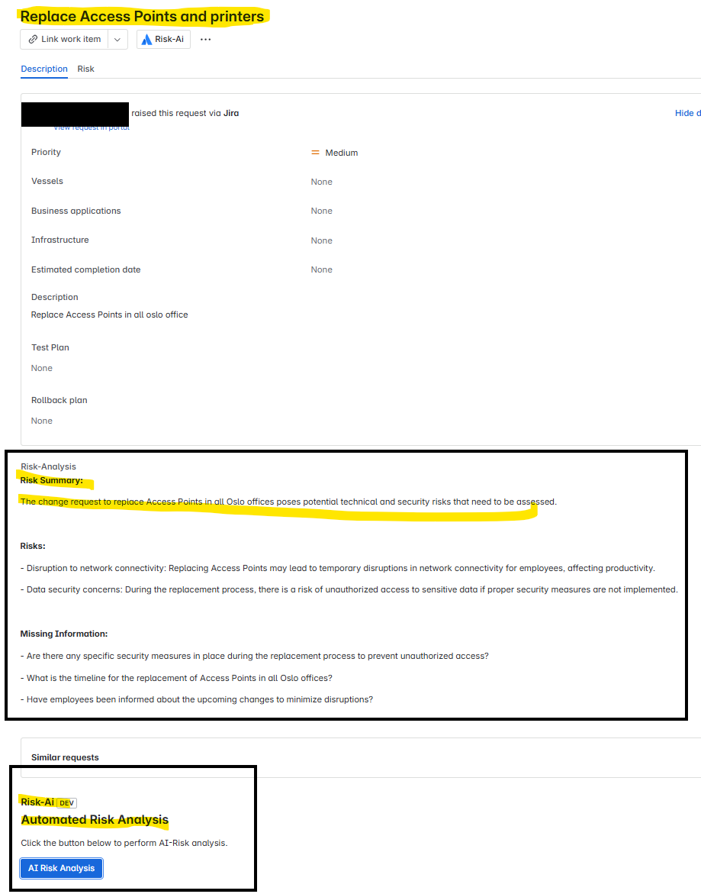

Absolutely — here's a clean, professional `README.md` written in a straightforward tone, suitable for internal or external technical documentation.

---

````markdown
# Risk-AI: Jira Forge App for Automated Change Risk Analysis

Risk-AI is a Jira Forge app that provides AI-powered risk analysis for Change Requests in Jira Service Management. It reads the summary and description of an issue, sends the data to an external API (powered by OpenAI or a custom model), and writes the generated risk insights back into a Jira custom field.

---

## Prerequisites

Before you deploy or use the app, ensure the following are in place:

### Jira Setup

- You are using a **company-managed Jira project**.
- The **issue type is "Change"**, typically used in ITSM projects.
- You have created a **custom field** to hold the AI-generated risk assessment.
  - Suggested name: `AI Risk Analysis`
  - Field type: Paragraph (multi-line text)
  - Assigned to the `Change` issue type via the appropriate screen scheme.

### External Risk API

You must have a working backend API endpoint that:

- Accepts a `POST` request with `summary` and `description` in JSON.
- Returns a risk analysis response in plain text or structured format.

This API is typically hosted in Azure Container Apps or similar platforms.

### Development Environment

- [Node.js](https://nodejs.org/) version 18 or later
- [Forge CLI](https://developer.atlassian.com/platform/forge/getting-started/) installed

```bash
npm install -g @forge/cli
forge login
````

---

## Setting Forge Environment Variables

Before deploying, set the necessary variables using Forge CLI:

```bash
forge variables set --env development RISK_API_URL https://your-api-url.example.com/analyze
forge variables set --env development API_TOKEN your-secret-token
```

Use `forge variables list` to confirm they are stored.

---

## What the App Does

* Adds a panel to Jira issues of type `Change`.
* On button click, it:

  1. Fetches the issue’s summary and description.
  2. Sends them to the risk API.
  3. Receives a plain-text risk analysis.
  4. Writes the result into the custom Jira field (`AI Risk Analysis`).




---

## Project Structure

```
Risk-Ai/
├── manifest.yml             # Forge manifest
├── src/
│   ├── frontend/
│   │   └── index.jsx        # React UI (issue panel)
│   └── index.js             # Resolver function
├── .env                     # Optional; ignored in git
└── README.md
```

---

## How to Deploy

1. **Deploy the app code**

```bash
forge deploy
```

2. **Install the app in your Jira site**

```bash
forge install
```

If installation fails due to site permissions, use the Atlassian Developer Console to generate an installation link.

---

## Example Usage

A Jira user opens a Change Request and clicks the “AI Risk Analysis” button in the issue panel. The app analyzes the request and writes the response into the custom field. The response typically includes:

* A short risk summary
* A list of risks with brief explanations
* Optional missing information if the ticket lacks key details

---

## Security Note

Do not hard-code secrets or tokens in the source code. Use Forge’s built-in environment variable system to manage sensitive information securely.

---


```


```
